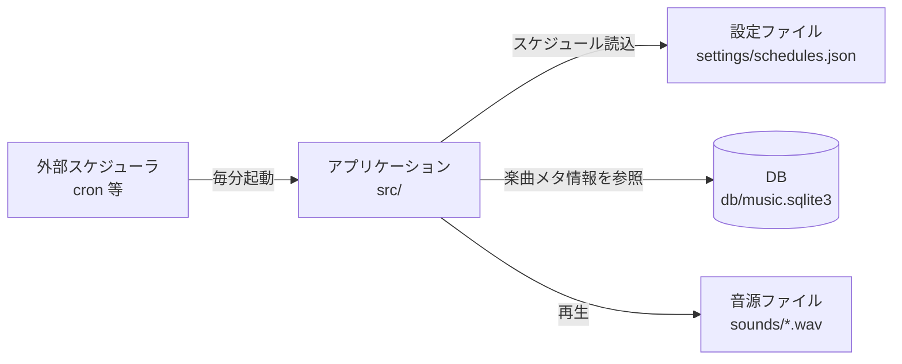
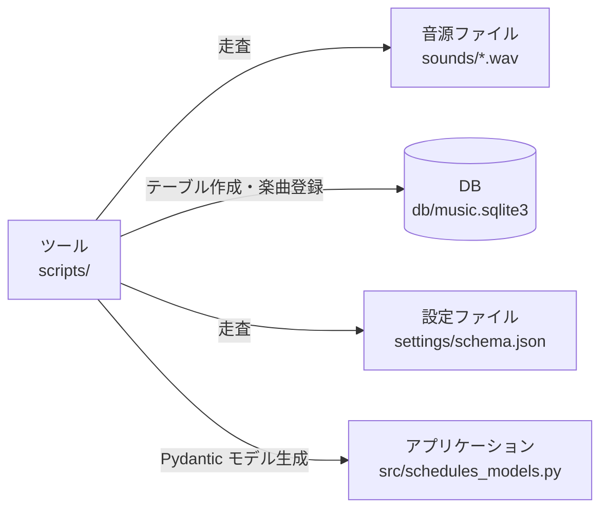
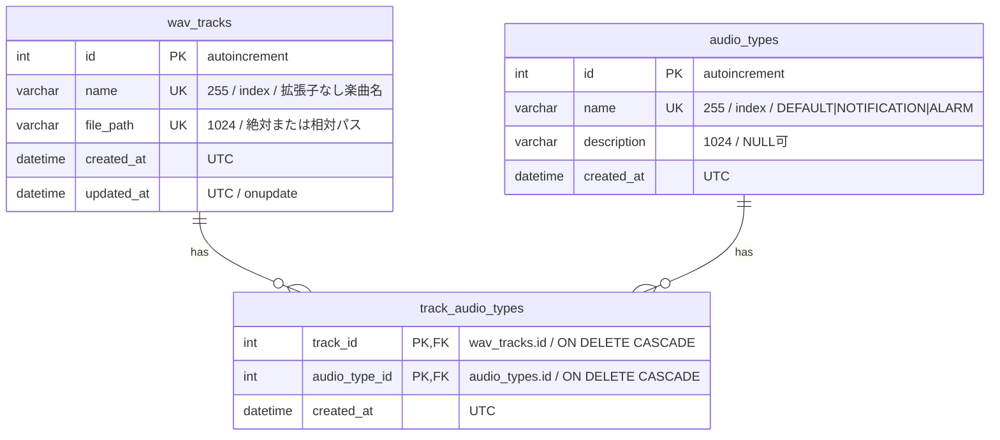
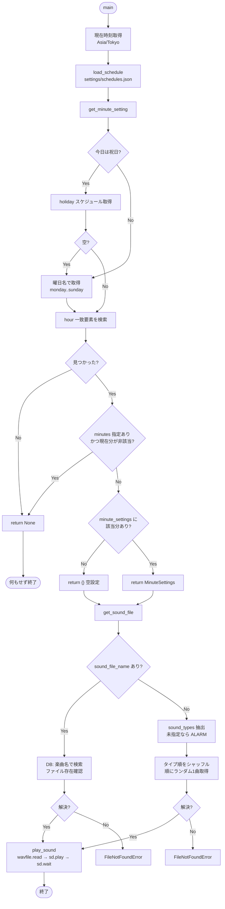
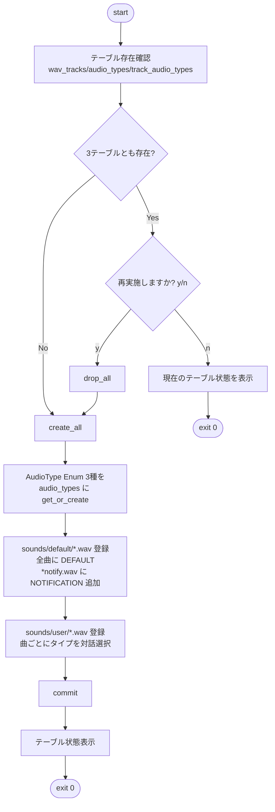

# 概要設計書 — タイムアナウンスメント

| 項目 | 内容 |
| --- | --- |
| システム名 | タイムアナウンスメント (time-announcement-backend) |
| バージョン | 0.1.0 |
| 対象実装 | `src/main.py`, `src/music_db.py`, `src/schedules_models.py`, `scripts/migrate_music_db.py` |
| 作成日 | 2026-07-29 |
| 備考 | 本書は既存実装からの起こし（As-Is ドキュメント） |

---

## 1. システム概要

### 1.1 目的

曜日 × 時刻のスケジュール定義に従って、指定された `.wav` 音源を再生する時報／通知アナウンス機構。

### 1.2 特徴

- 実行モデルは **ワンショット**。`main()` は「起動された瞬間の時刻」がスケジュールに合致するかを判定し、合致すれば1曲再生して終了する。常駐ループやスケジューラは内蔵していない。
- したがって **毎分の起動は外部（cron / systemd timer / タスクスケジューラ）に委譲する**前提の設計。
- 楽曲の実体はファイルシステム（`sounds/`）、楽曲のメタ情報と分類は SQLite（`db/music.sqlite3`）で管理する二層構成。

### 1.3 スコープ外（現状の実装に無いもの）

- スケジュール JSON の実行時バリデーション（後述 6.1）
- 音声デバイス不在時のフォールバック／リトライ
- ログ出力基盤（`print` のみ）
- 認証・API・GUI

---

## 2. システム構成

### 2.1 コンポーネント構成

#### 2.1.1 アプリケーション（定常運用時）



#### 2.1.2 ツール（セットアップ時）



### 2.2 モジュール責務

| モジュール | 責務 |
| --- | --- |
| `src/main.py` | エントリポイント。現在時刻の判定、スケジュール解決、楽曲解決、再生。 |
| `src/music_db.py` | SQLAlchemy ORM モデル定義、エンジン／セッション生成、楽曲検索クエリ。 |
| `src/schedules_models.py` | `settings/schema.json` から `datamodel-codegen` で自動生成された Pydantic モデル。実行時は主に `AudioType` Enum が使われる。**手編集禁止**。 |
| `scripts/migrate_music_db.py` | DB 初期化・音源登録（対話式）。 |
| `scripts/generate_model` | `schema.json` → `schedules_models.py` の再生成シェル。 |

### 2.3 技術スタック

| 区分 | 採用技術 |
| --- | --- |
| 言語 | Python 3.10+ （mypy 設定上は 3.13 想定） |
| パッケージ管理 | uv (`pyproject.toml` / `uv.lock`) |
| DB | SQLite 3 + SQLAlchemy 2.x (Declarative / `Mapped` 記法) |
| 音声再生 | `scipy.io.wavfile`（読込） + `sounddevice`（PortAudio 経由の再生） |
| 祝日判定 | `jpholiday` |
| モデル生成 | `datamodel-code-generator` (Pydantic v2) |
| Lint | ruff (line-length 88) |
| 型検査 | mypy (strict) |
| 開発環境 | devcontainer |

### 2.4 ディレクトリ構成

```
/app
├── db/                       # SQLite 実体（*.sqlite3 は .gitignore）
├── docs/                     # 本ドキュメント群
├── scripts/
│   ├── generate_model        # Pydantic モデル再生成
│   └── migrate_music_db.py   # DB マイグレーション
├── settings/
│   ├── schema.json           # スケジュール JSON Schema (draft-07)
│   ├── sample_schedules.json # 設定サンプル
│   └── schedules.json        # 実設定（.gitignore 対象・要手動配置）
├── sounds/
│   ├── default/              # 既定音源（リポジトリ同梱）
│   └── user/                 # ユーザー追加音源
└── src/
    ├── main.py
    ├── music_db.py
    └── schedules_models.py
```

---

## 3. データ設計

### 3.1 ER 図



### 3.2 テーブル定義

#### `wav_tracks`（楽曲マスタ）

| カラム | 型 | 制約 | 説明 |
| --- | --- | --- | --- |
| `id` | INTEGER | PK, AUTOINCREMENT | 内部 ID |
| `name` | VARCHAR(255) | NOT NULL, UNIQUE, INDEX | 楽曲名。`.wav` 拡張子を除去した名前（例: `sample.wav` → `sample`） |
| `file_path` | VARCHAR(1024) | NOT NULL, UNIQUE | ファイルパス。マイグレーション時は `sounds/...` の相対パス文字列が格納される |
| `created_at` | DATETIME(tz) | NOT NULL | 登録時刻（UTC） |
| `updated_at` | DATETIME(tz) | NOT NULL, onupdate | 更新時刻（UTC） |

#### `audio_types`（音声タイプマスタ）

| カラム | 型 | 制約 | 説明 |
| --- | --- | --- | --- |
| `id` | INTEGER | PK, AUTOINCREMENT | 内部 ID |
| `name` | VARCHAR(255) | NOT NULL, UNIQUE, INDEX | タイプ名。`AudioType` Enum と同値（`DEFAULT` / `NOTIFICATION` / `ALARM`） |
| `description` | VARCHAR(1024) | NULL 可 | 説明。マイグレーションでは常に `NULL` |
| `created_at` | DATETIME(tz) | NOT NULL | 登録時刻（UTC） |

#### `track_audio_types`（楽曲⇔タイプ 中間テーブル）

| カラム | 型 | 制約 | 説明 |
| --- | --- | --- | --- |
| `track_id` | INTEGER | PK, FK → `wav_tracks.id` ON DELETE CASCADE | |
| `audio_type_id` | INTEGER | PK, FK → `audio_types.id` ON DELETE CASCADE | |
| `created_at` | DATETIME(tz) | NOT NULL | |

- 複合主キーに加えて `UniqueConstraint("track_id", "audio_type_id", name="uq_track_audio_type")` を明示付与。
- SQLite の外部キー制約は既定で無効のため、`create_sqlite_engine()` が `connect` イベントで `PRAGMA foreign_keys=ON` を発行して有効化している（[music_db.py:67-79](../src/music_db.py#L67-L79)）。

### 3.3 リレーション

`WavTrack.types` ↔ `AudioTypeMaster.tracks` の多対多。`secondary="track_audio_types"`、`lazy="selectin"`（N+1 回避のため一括ロード）。

### 3.4 DB アクセス API

| 関数 | 説明 |
| --- | --- |
| `create_sqlite_engine(db_path="db/music.sqlite3")` | 親ディレクトリを自動作成し、FK 有効化済みエンジンを返す |
| `create_session_factory(engine)` | `autoflush=False`, `autocommit=False`, `expire_on_commit=False` の `sessionmaker` |
| `init_db(engine)` | `Base.metadata.create_all` |
| `get_track_by_name(session, track_name)` | 楽曲名の完全一致検索（1件） |
| `get_random_track_by_type(session, type_name, exclude_track_names=None)` | タイプで絞り込み、`ORDER BY RANDOM()` で1件。除外名リスト指定可（※ `main.py` からは未使用） |

---

## 4. 設定設計

### 4.1 スケジュール設定 `settings/schedules.json`

- スキーマ定義: `settings/schema.json`（JSON Schema draft-07）
- 実ファイルは `.gitignore` 対象。`settings/sample_schedules.json` をコピーして作成する。

構造:

```jsonc
{
  "monday": [ /* DailySchedule: 最大24要素 */ ],
  // ... tuesday 〜 sunday（すべて必須）
  "holiday": [ /* 任意。日本の祝日に適用 */ ]
}
```

`DailyScheduleItem`:

| キー | 必須 | 型 | 説明 |
| --- | --- | --- | --- |
| `hour` | ○ | number | 時 (0-23) |
| `minutes` | | number[] | 対象の分 (0-59)。**省略／空配列の場合は「全ての分」が対象**（[main.py:171-173](../src/main.py#L171-L173)） |
| `minute_settings` | | object | キーが分の文字列（例 `"30"`）、値が `MinuteSettings` |

`MinuteSettings`:

| キー | 型 | 説明 |
| --- | --- | --- |
| `sound_file_name` | string | 再生する楽曲名。指定時は最優先で、`sound_types` は無視される |
| `sound_types` | AudioType[] | 再生対象タイプ一覧（`DEFAULT` / `NOTIFICATION` / `ALARM`） |

### 4.2 Pydantic モデル生成

```bash
./scripts/generate_model
# = uv run datamodel-codegen --input settings/schema.json \
#     --output src/schedules_models.py \
#     --input-file-type jsonschema --output-model-type pydantic_v2.BaseModel
```

`schema.json` を変更したら必ず再生成する。

---

## 5. 機能設計

### 5.1 再生処理フロー（`main.py`）



### 5.2 主要関数仕様

#### `load_schedule(path) -> WeeklySchedule`

- JSON を読み込んでそのまま返す。**戻り値の型注釈は `WeeklySchedule` だが実体は `dict`**（Pydantic による検証は行わない）。
- `json.JSONDecodeError` 時は `{}` を返す。
- ファイル不在時は `FileNotFoundError` が送出される（捕捉されない）。

#### `get_minute_setting(schedule, now) -> Optional[MinuteSettings]`

判定順序:

1. `jpholiday.is_holiday(now.date())` が真かつ `schedule["holiday"]` が空でなければ、`holiday` スケジュールを採用。
2. それ以外は `now.strftime("%A").lower()`（`monday`…`sunday`）のスケジュールを採用。キーが無ければ `[]`。
3. `hour` が一致する要素を先頭から探索。無ければ `None`。
4. `minutes` が指定されており現在分が含まれなければ `None`。`minutes` が未指定または空配列なら分の絞り込みをしない。
5. `minute_settings[str(minute)]` があればそれを返す。無ければ空辞書 `{}` を返す（＝「再生する。曲は既定ルールで決める」の意）。

> `None`（再生しない）と `{}`（既定で再生する）を返り値で区別している点が本関数の要。

#### `get_sound_file(minute_settings) -> str`

| 条件 | 挙動 |
| --- | --- |
| `minute_settings is None` | `ValueError` |
| `sound_file_name` が非空 | 名前を正規化（trim + `.wav` 除去、大文字小文字非依存）して DB 検索。ヒットかつ実ファイルが存在すればそのパスを返す。**`sound_types` は無視**。解決できなければ `FileNotFoundError` |
| `sound_file_name` なし | `sound_types` を抽出（不正値は除外、重複は除去）。空なら `["ALARM"]`。タイプ順をシャッフルし、各タイプで `ORDER BY RANDOM()` の1曲を取得。実ファイルが存在する最初の1件を返す。全滅なら `FileNotFoundError` |

#### DB 接続の遅延初期化

`_get_db_session_factory()` はモジュールグローバル `_DB_SESSION_FACTORY` にキャッシュする。**DB ファイルが存在しない場合は `None` を返し**、楽曲解決は必ず失敗（→ `FileNotFoundError`）となる。

#### `play_sound(path)`

`scipy.io.wavfile.read` で読み込み、`sounddevice.play` → `sd.wait()` で再生完了まで同期待機。

### 5.3 マイグレーション処理（`scripts/migrate_music_db.py`）



実行:

```bash
uv run python scripts/migrate_music_db.py
```

仕様上のポイント:

- `_ensure_src_on_syspath()` で `src/` を `sys.path` に追加してから `music_db` を import する。
- `_upsert_track_by_wav()`: 楽曲名で既存検索し、無ければ INSERT、あればパスが変わっていれば更新（冪等）。
- `sounds/default` の登録ルール: 全曲 `DEFAULT`、ファイル名が `notify.wav` で終わるものに `NOTIFICATION` を追加。
- `sounds/user` の登録ルール: 対話で番号（カンマ区切り複数可）を選択し、**選択したタイプで上書き**（`track.types = [...]`）。
- 対話は `input()` 依存のため、非対話環境（CI 等）ではそのままでは実行不可。

---

## 6. 既知の課題・留意事項

| # | 内容 | 影響 |
| --- | --- | --- |
| 6.1 | `load_schedule` が Pydantic 検証を行わず生 `dict` を返す。型注釈（`WeeklySchedule`）と実体が乖離している。 | 不正な設定ファイルが実行時まで検知されない。`mypy --strict` でも整合しない |
| 6.2 | `schema.json` / `schedules_models.py` では `minute_settings` の値に `sound_file_name` が **必須**。一方 README や実装は「`sound_types` のみ指定」を正当なケースとして扱う。 | スキーマ検証を導入すると既存設定が弾かれる。スキーマ側を `required` から外すのが妥当 |
| 6.3 | `settings/schedules.json` が存在しない場合、`load_schedule` で `FileNotFoundError` が捕捉されず異常終了する。 | 初回セットアップ時に分かりにくいエラー |
| 6.4 | `get_random_track_by_type` の `exclude_track_names` 引数が `main.py` から未使用。 | 連続再生時の重複回避が未実装（将来拡張の受け皿） |
| 6.5 | `mypy.ini` の `mypy_path`（`layers/...`）および `plugins`（`jsonschema_typed`）が本リポジトリに存在しない。 | mypy が現状そのままでは動作しない |
| 6.6 | ログが `print` のみ（`get_minute_setting` 内で祝日判定結果とスケジュールを標準出力）。 | cron 運用時のログ収集・レベル制御ができない |
| 6.7 | テストコードおよびテストランナー（pytest 等）が未導入。 | 回帰検知ができない（→ 別紙「テスト設計書」参照） |
| 6.8 | `file_path` は相対パス文字列で保存されるため、`main.py` の実行カレントディレクトリに依存して `os.path.exists` が失敗しうる。 | 起動方法によって再生できない可能性 |

---

## 7. セットアップ・運用手順

```bash
# 1. 依存導入
uv sync

# 2. スケジュール設定を作成
cp settings/sample_schedules.json settings/schedules.json

# 3. 音源を配置（任意）
#    sounds/user/ に .wav を置く

# 4. DB 構築（対話式）
uv run python scripts/migrate_music_db.py

# 5. 単発実行（現在時刻で判定）
uv run python src/main.py
```

定時運用は外部スケジューラで毎分起動する。例（crontab、リポジトリルートを CWD にすること）:

```cron
* * * * * cd /app && /usr/local/bin/uv run python src/main.py >> /var/log/time-announcement.log 2>&1
```

---

## 8. 参照

- スキーマ定義: [settings/schema.json](../settings/schema.json)
- 設定サンプル: [settings/sample_schedules.json](../settings/sample_schedules.json)
- テスト設計: [test_design.md](./test_design.md)
- 利用手順: [README.md](../README.md)
